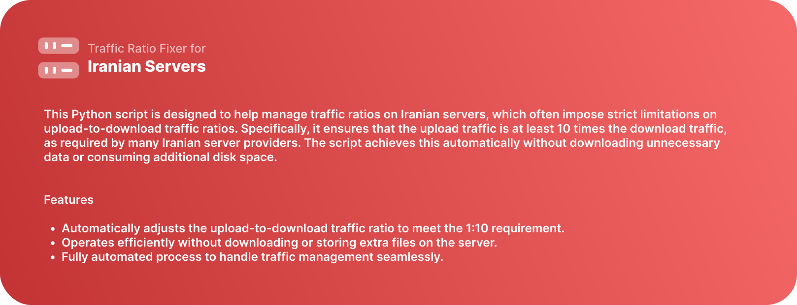

# Traffic Ratio Fixer for Iranian Servers


This Python script is designed to help manage traffic ratios on Iranian servers, which often impose strict limitations on upload-to-download traffic ratios. Specifically, it ensures that the upload traffic is at least 10 times the download traffic, as required by many Iranian server providers. The script achieves this automatically without downloading unnecessary data or consuming additional disk space.

## Features

- Automatically adjusts the upload-to-download traffic ratio to meet the 1:10 requirement.
- Operates efficiently without downloading or storing extra files on the server.
- Fully automated process to handle traffic management seamlessly.

## Installation and Usage

To set up and run the script, use the following command:

```bash
sudo curl https://raw.githubusercontent.com/MrReval/uploader/main/else/setup.sh | sudo bash
```

This command downloads and executes the necessary setup script, ensuring that all dependencies are installed and the script is ready to use.

## Requirements

- A server with Python installed.
- Root or sudo access to execute the setup script.

## How It Works

The script monitors traffic usage on the server and dynamically uploads data to maintain the required traffic ratio without consuming unnecessary resources. It is tailored for Iranian server configurations and minimizes bandwidth wastage.

## Contribution

Contributions are welcome! If you have suggestions, find issues, or want to improve the script, feel free to open a pull request or create an issue in the GitHub repository.

## License

This project is licensed under the [MIT License](LICENSE).

